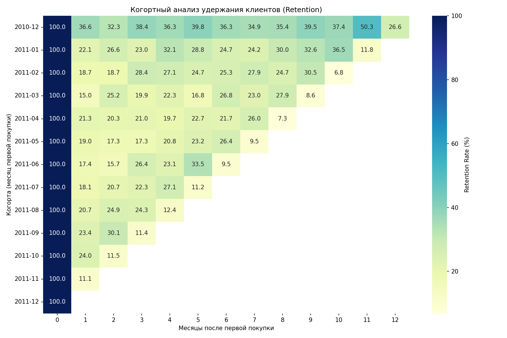
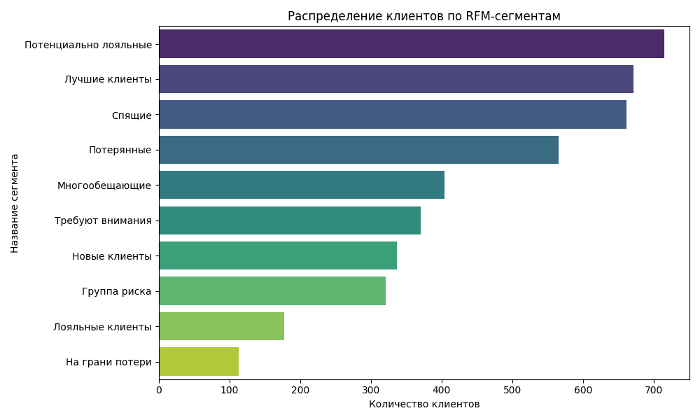
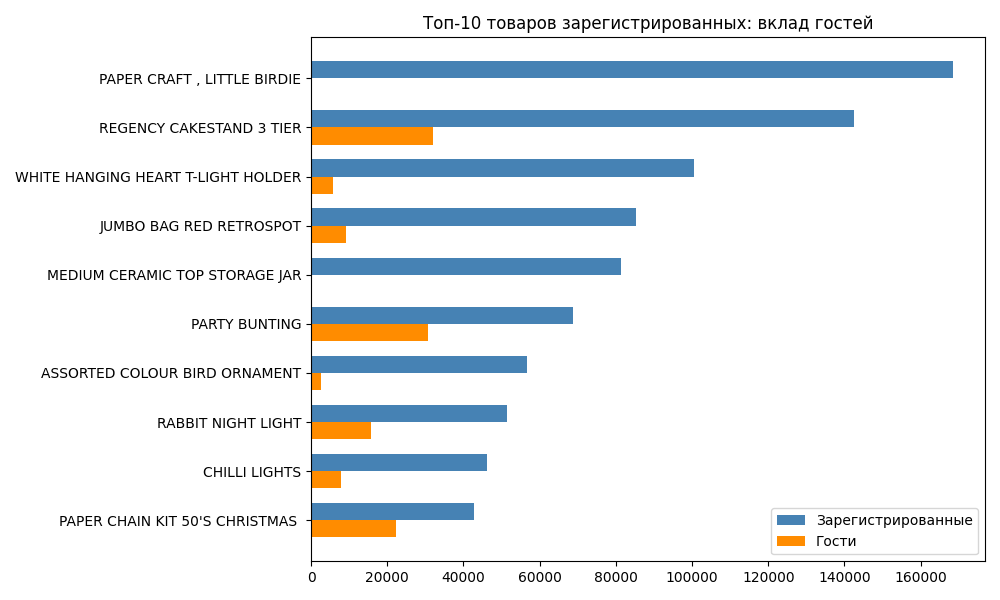
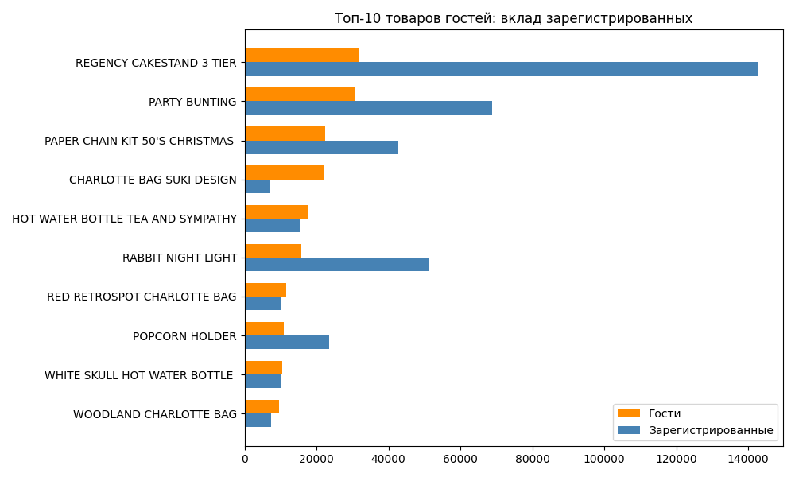

# Когортный анализ удержания клиентов (Retention)

## Описание проекта

Анализ поведения клиентов интернет-магазина на основе открытых данных **Online Retail** (UCI / Kaggle).  
Цель — оценить удержание клиентов с помощью когортного анализа.

## Данные

- **Источник:** [Kaggle](https://www.kaggle.com/) / [UCI ML Repository](https://archive.ics.uci.edu/ml/datasets/Online+Retail)
- **Файл:** [`Online_Retail.csv`](https://drive.google.com/uc?export=download&id=1mWn89h3cngz3t2ejPLX0xlGwIVWRZL7q) (прямая ссылка для скачивания)
- **Очищенный файл** создаётся скриптом `clean.py`

## Задачи

1. Очистить данные: удалить дубликаты, пропуски в CustomerID, возвраты (кредит-ноты), нулевые и отрицательные количества/цены.
2. Построить когорты по месяцу первой покупки.
3. Рассчитать удержание (retention rate) для каждой когорты.
4. Визуализировать результат в виде тепловой карты.

## Инструменты

- Python 3
- pandas – обработка данных
- matplotlib, seaborn – визуализация

## Как запустить

1. Скачайте исходный файл `Online_Retail.csv` по [ссылке](https://drive.google.com/uc?export=download&id=1mWn89h3cngz3t2ejPLX0xlGwIVWRZL7q).
2. Установите библиотеки:
   ```bash
   pip install pandas matplotlib seaborn
   ```

3. Запустите скрипт очистки:

   ```bash
   python clean.py
   ```

4. Запустите скрипт анализа:

   ```bash
   python retention.py
   ```

## Результаты



### Основные выводы

Удержание на первый месяц после покупки – около 30% в среднем по когортам.
Наблюдается сезонный пик в ноябре (предновогодние покупки): retention для когорты декабря 2010 года достигает 50% на 11-й месяц.
Долгосрочное удержание (через 12 месяцев) – 26.6% для когорты декабря 2010, что говорит о лояльной аудитории.

### Рекомендации
Усилить коммуникацию с клиентами в периоды спада (февраль–март) с помощью персонализированных предложений и программ лояльности.


# RFM-анализ клиентов

## Описание
RFM-сегментация (Recency, Frequency, Monetary) позволяет разделить клиентов на группы по давности, частоте и сумме покупок для персонализации маркетинга.

## Реализация
- **Recency** – количество дней с последней покупки (разбивка на 5 квантилей, баллы 5–1).
- **Frequency** – количество заказов (ручные границы: 1, 2–5, ≥6 → баллы 1,2,3).
- **Monetary** – общая сумма покупок (5 квантилей, баллы 1–5).
- Итоговый RFM-код (например, 535) сопоставлен с названием сегмента через словарь из 75 комбинаций.

## Результаты


**Выводы (на основе 4339 клиентов):**
- **Потенциально лояльные** – 16.5%, требуют вовлечения.
- **Лучшие клиенты** – 15.5%, основа выручки.
- **Спящие и потерянные** – 28.3%, можно пробовать реактивацию.
- **Требуют внимания + группа риска** – 16%, нужны срочные меры.

## ABC-анализ: сравнение топ-товаров зарегистрированных и гостей




**Выводы:**  
- Зарегистрированные клиенты лидируют по товару «PAPER CRAFT», который почти не покупают гости.  
- Товар «REGENCY CAKESTAND 3 TIER» входит в топ обеих групп, но зарегистрированные покупают его значительно больше.  
- Гости активно приобретают «PARTY BUNTING» и «PAPER CHAIN KIT», которые также популярны у зарегистрированных, но с меньшим отрывом.  
- Некоторые товары гостей (например, «CHARLOTTE BAG») почти не интересуют зарегистрированных, что может указывать на разные потребительские предпочтения.

Рекомендуется использовать эти данные для сегментированных рекламных кампаний и персонализации предложений.
